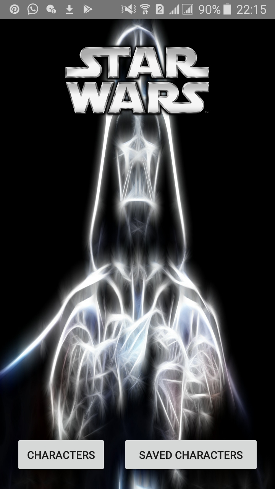
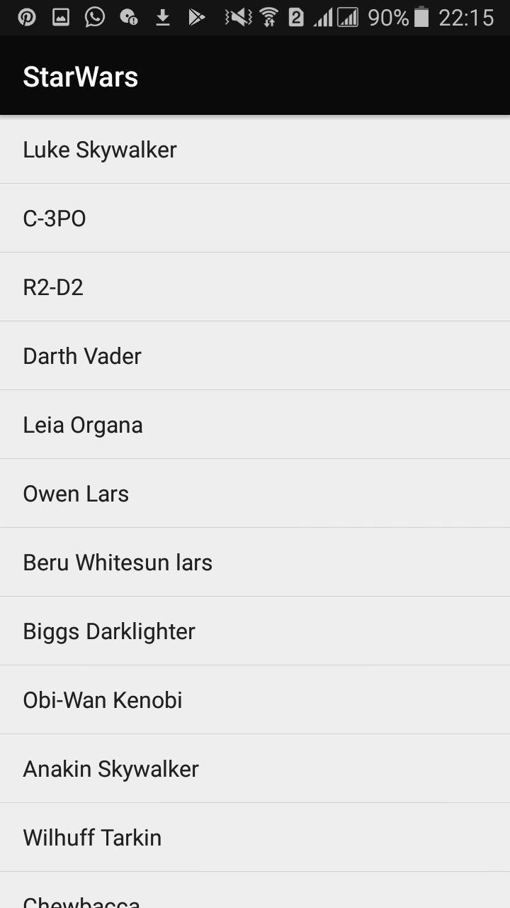

# StarWars
StarWars App is an Androind application.
## Description
The App has as functionality to demonstrate the characters in the Star Wars movie where the user will get the ability to view them, to save, to rename and to delete the saved ones.
## Prerequisites
* Install android studio, extract it and open it
* in the bin folder, right click and open it in the terminal
* type ./studio.sh
## Bugs
*The Application is not complete.  
*Implemenatation of the API manual( it was not displaying the data required in the app).
## Technologies
Android(Java)
## Screenshoots

Home Page

List of characters

<h2> Author</h2>
Umutesi Grace
<h2> License </h2>
MIT License

Copyright (c) 2019 GraceUmutesi

Permission is hereby granted, free of charge, to any person obtaining a copy of this software and associated documentation files (the "Software"), to deal in the Software without restriction, including without limitation the rights to use, copy, modify, merge, publish, distribute, sublicense, and/or sell copies of the Software, and to permit persons to whom the Software is furnished to do so, subject to the following conditions:

The above copyright notice and this permission notice shall be included in all copies or substantial portions of the Software.

THE SOFTWARE IS PROVIDED "AS IS", WITHOUT WARRANTY OF ANY KIND, EXPRESS OR IMPLIED, INCLUDING BUT NOT LIMITED TO THE WARRANTIES OF MERCHANTABILITY, FITNESS FOR A PARTICULAR PURPOSE AND NONINFRINGEMENT. IN NO EVENT SHALL THE AUTHORS OR COPYRIGHT HOLDERS BE LIABLE FOR ANY CLAIM, DAMAGES OR OTHER LIABILITY, WHETHER IN AN ACTION OF CONTRACT, TORT OR OTHERWISE, ARISING FROM, OUT OF OR IN CONNECTION WITH THE SOFTWARE OR THE USE OR OTHER DEALINGS IN THE SOFTWARE. Copyright (c) 2019 Grace Umutesi

